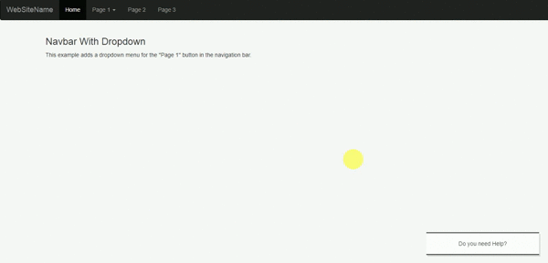
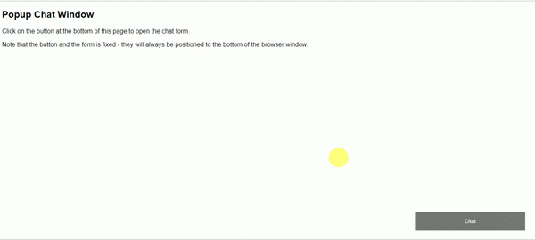

# Chatbots
This project is dedicated Repositry for the chatbots. In this all the chatbots i tried to integrated with the html.

<h3>1. Watson assistant Chatbot:</h3> It is made for the restraurant purpose just a basic bot for practicing and documenting purpose.
<h3>How to run :</h3> simply right click on the HTML file and open with browser. NOTE: Make sure internet is connected...
<h3>Demo:</h3> 

<h3>2. Dialogflow Google Chatbot:</h3> It is made for my resume it will tell about my skills and things.
<h3>How to run :</h3> simply right click on the HTML file and open with browser. NOTE: Make sure internet is connected...
<h3>Demo:</h3> 

<h3>3. Tawk.to without watermark:</h3> it is simple chat widget which can be used for chatting purposes.
<h3>How to run :</h3> Simply host the code from any localhost or any web server. NOTE: Make sure internet is connected and html file should be hosted...
<h3>Demo:</h3> 
<h1>Blog:</h1> https://medium.com/@aadityamonu67/how-to-use-tawk-to-without-watermark-b5a6b5e2783e
